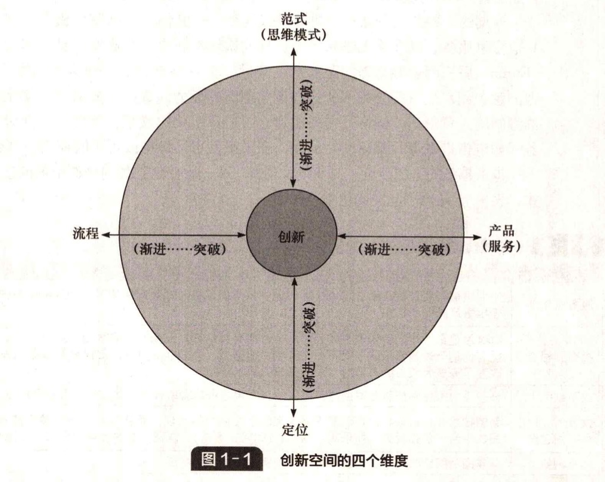
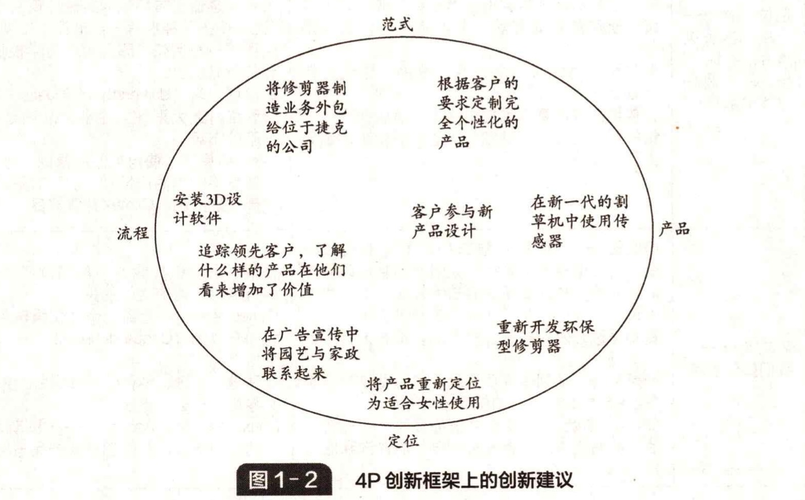

# 1.9 创新的范围和类型

&#x20;       如果说创新是一个过程，那么我们需要考虑过程的产出。我们如何创新 —— 存在怎样的机会让我们创造不一样的东西，并能从实现这些创意的过程中获取价值呢？

&#x20;       有时这意味着全新的可能性，如技术的根本性突破。例如，基于基因控制的新药物在疾病治疗方面开辟了新市场。手机、PDA以及其他设备彻底改变了人们沟通的时间和地点。&#x20;

&#x20;       同样重要的是发现新市场的能力。亨利·福特并未发明汽车，却凭借T型车 —— “所有人都买得起的汽车” 以多数人可接受的价格开发了个体交通的天众市场。eBay 数十亿美元的标价并不是因为在线拍卖这个创意背后的技术，而是因为它开创并发展了市场。&#x20;

&#x20;       创新不仅仅是开发新市场，它也可以是为既有的成熟市场提供新的服务。廉价航空公司依然立足于交通运输市场，但像西南航空、易捷航空和瑞安航空等公司的创新却改变了航空旅游业并扩大了市场。一个新的具有挑战性的创新领域是发展中国家先 前未被满足的市场 —— 那里有 40 亿人，每天收入不到 2 美元。为了满足被普拉哈拉德（Prahalad）称为 “金字塔底层” 的众多人口的需要而开发完全不同的创新产品和服务，其潜力是巨大的，而从中积累的经验也会冲击发达国家的原有市场。

&#x20;       创新也不仅仅局限于工业制成品。在大多数经济体中，服务行业都是主要组成部分，因此存在很大的创新空间。基于互联网浪潮的新生力量已经大范围改写了许多行业的游戏规则，例如亚马逊之手零售业、易趣之于市场交易和拍卖、谷歌之于广告、 Skype 之于电话等。其他公司则利用网络来帮助它们转变商业模式，诸如提供廉价机票、在线购物以及音乐下载等。

**创新空间的四个维度**&#x20;

&#x20;   本质上，我们谈论的是变化，而变化可以有多种形式。根据本书的目的，我们将 重点关注四个方面：

* 产品创新（productinnovation） —— 组织提供的东西（产品和服务）的变化。
* 流程创新（processinnovation） —— 产品和服务的生产和交付方式的变化。
* 定位创新（positioninnovation） —— 产品和服务进入市场的环境的变化。
* 范式创新（paradigminnovation） —— 影响组织业务的潜在思维模式的变化。&#x20;

&#x20;   图 1-1 展示了 4P（四个创新维度）如何构建创新空间。例如一款新设计的轿 车，为容易发生事故的婴儿提供新的保险种类，或安装新的家庭娱乐系统等，这些都 是产品创新的例子。汽车及家庭娱乐系统的制造工艺和设备上的变化，或者保险业力 公手续和任务排序的变化，则是流程创新的例子。&#x20;

&#x20;       有时，创新维度之间的界限是比较模糊的。例如，一艘喷气式海洋渡轮既有产品 创新也有流程创新。对于服务业来说，其产品和流程两个方面通常是一体的，因而是这方面的典型例子。例如，一个新的假日旅行计划是产品创新还是流程创新？

&#x20;       创新也可以通过在特定用户情境下重新定位对既有产品和流程的感知来实现。例如在英国，一个历史悠久的产品名为葡萄适（Lucozade），早在 1927 年作为葡萄糖饮品帮助儿童发育和病人康复。后来，品牌所有者葛兰素史克（GSK）拼弃了它与疾病的关联，转而晒向日渐增长的健康市场，把它作为一款提高运动效能的饮品重新推出。这种转变是定位创新的一个例子。类似的例子还有哈根达斯，它用一种全新的方法使早已存在且容易加工的产品（冰激凌）获得了盈利的机会。其策略是针对不同的细分市场，将产品重新定位为带给成年人感官上的愉悦享受 —— 本质上强调的是 “成年人的冰激凌”。&#x20;

&#x20;       有时，当我们重构自己看待事物的方式时，创新的机会也会浮现出来。亨利 • 福 特从根本上改变了交通的面貌，并不是因为他发明了汽车（他进入这一行业相对较 晚），也不是因为他开发了组装汽车的制造流程（作为一个基于手工制造的专门行业 汽车制造业当时已经有 20 年的历史）。他的贡献在于改变了潜在的模式，将只为少数有钱人提供手工制造的产品转变为向任何人提供他们买得起的汽车。从手工制造到规模化生产的转变，则完全是汽车生产和交付（以及之后的无数其他产品和服务）的一场革命。当然，要使这个想法付诸实践，还需要大量的产品和流程创新 —— 涉及零件 设计、机械制造和工厂布局，特别是用以组织工作的社会系统等方面。值得注意的是，福特目前的自我定位不再是汽车制造商，而是全球移动出行公司，这反映了整个行业的技术和社会趋势，以及重新思考其商业模式的必要性。&#x20;

&#x20;       近期的一些范式创新 —— 思维模式转变 —— 的例子包括廉价机票、网上保险及其他金融服务，以及将咖啡和果汁这样的饮料重新定位为高端产品。尽管安然公司 （Enron）后来因金融舞弊问题而声名狼籍，但它最初作为一个天然气管道承包商，因为意识到水电气等公用事业方面范式创新的潜力而赢得了显赫的市场地位。在取消管制的大背景下，网格分布系统建立了全球范围的联系，能源和其他公用事业服务（如电信带宽等）都逐渐商品化，在未来就可以像糖或可可的期货一样交易了。&#x20;

&#x20;       越来越多的组织谈论 “商业模式创新” —— 改变组织如何创造价值的基本思维模 式，表 1-5 给出了此类变化的一些例子。&#x20;

**表 1-5 范式创新的例子**&#x20;

| 商业模式创新     | 它如何改变了游戏规则                                                                                                     |
| ---------- | -------------------------------------------------------------------------------------------------------------- |
| 服务业化       | 专业机械公司卡特彼勒（Caterpillar）现在从帮助其机器高效运转的服务合同中赚取的利润与当初出售产品时一样多                                                      |
| 拥有到租赁      | Spotify是最成功的音乐流媒体公司之一，拥有大约800万用户。它改变了模式，让人们从想要拥有他们听过的音乐转向租用一个巨大的音乐库。以类似的方式，Zipcar和其他汽车租赁企业改变了许多大城市的人们对汽车所有权的需求 |
| 线下到线上      | 许多企业都是围绕着互联网成长起来的，并用虚拟体验取代了实体接触，例如零售业                                                                          |
| 大量个性化和共同创造 | 新的技术和日益增长的定制需求不仅推动个性化产品出现，而且催生了用户参与并共同创造产品的平台，例如玩具（如乐高）、服装（如阿迪达斯），以及复杂的设备如汽车（本地汽车）等                            |
| 体验创新       | 从商品到围绕核心产品创造一种体验，例如咖啡、图书等                                                                                      |

&#x20;       范式创新可以由许多不同的事物触发，例如，新技术、具有不同价值预期的新市 场、新的游戏规则、新的环境条件（气候变化、能源危机）等。例如，互联网技术的 出现使我们能够彻底重构许多业务的开展方式。过去，类似的思想革命是由蒸汽动 力、电力、大众运输（通过铁路和公路）和微电子等技术引发的。随着人们掌握纳米 技术或基因工程等新技术，类似的重构也很有可能发生。&#x20;

&#x20;       塔普斯科特和威廉斯（Tapscott and Williams）在著作《维基经济学》（Wikinomics）中强调了基于社会网络和社群的网上 “大规模协作” 这种范式转变所引起的创新浪潮。像乐高和阿迪达斯这样的公司正在通过让用户作为设计者和建造者 —— 而不是被动的消费者 ——来 使公司重新焕发活力；另一些人则去探索虚拟世界如第二 人生（Second Life）的潜力。对于全球变暖以及能源和材料等关键资源的可持续利用 的关注，正在许多行业中催生重大的范式创新。许多公司努力重新定位自身和产品 以应对这些重大的社会问题。表 1-6 按照 4P 模型给出了一些创新的实例。&#x20;

**表 1-6 4P模型的一些创新实例**&#x20;

创新类型 渐进性创新—— “做得更好 突破性创新 “做得不同 全新的软件，例如世界上第一款语音识别 微软Windows和苹果OS系统的更新换代 实质上是优化已有的软件创意 软件 产品创新一 现有车型的新款产品——本质上是优化已有的 丰田普锐斯带来了一种全新的概念——油电 我们为世界提 汽车设计 混合动力引擎 提高白织灯泡的性能 供什么 LED照明利用完全不同的更高效的发光原理 CD取代黑胶唱片一 本质上是存储技术的 Spotify等音乐流媒体服务——改变了人们的 进步 习惯，从拥有自己收集的音乐到租赁大型音 乐库 改进固定电话服务 Skype和其他的VoIP系统 流程创新 在线交易平台 拓展证券交易服务的范围 我们如何生产 改善拍卖行的业务操作流程 eBay 和交付产品和 通过升级设备来提高工厂的运行效率 丰田生产系统和其他“租赁”方式 服务 通过扩展支行来扩大银行服务的范围 在肯尼亚和菲律宾，手机银行——使用电话 提升零售行业物流 获得银行服务成为客户的一种选择 网上购物 面向未被满足的市场，例如，TataNano准 发展中但相对贫穷的印度市场，平均汽车价 哈根达斯改变了冰激凌的目标市场，将客户群 格约2000美元 从孩子转变为成人 廉价航空公司为囊中羞涩的旅客提供航空服 航空公司给不同旅客群体提供细分服务，例如 定位创新 务——创造新市场的同时破坏现有市场 维珍航空的尊尚客舱、英国航空的优选经济 产品和服务进 让每个孩子都拥有一台笔记本”项目及其 舱等 入的目标市 生形式一例如，印度政府为学校提供20美 戴尔和其他公司为个人客户提供个性化定制 场，以及我们 元的电脑 电脑 讲述的故事 凤凰城大学（UniversityofPhoenix）等机构通 为传统高等教育课程提供线上支援服务 过网络打造大型教育企业，从而延伸到各个 银行服务定位于关键细分市场——学生、退休 不同的市场 人群，等等 金字塔底层”使用类似的原则，进入巨大而 又截然不同的高产量/低利润市场——Aravind 眼部护理产品、Cemex建筑产品 博士伦——从眼镜到眼部护理的商业模式转 变，有效地摆脱了眼镜、太阳镜和隐形眼镜等 格莱眠银行和其他的小额信贷模式——重新 旧的业务，转向更新的高技术领域，如激光手 思考信用和贫穷之间的关系 术设备、专业光学仪器和人工视力的研究 iTunes平台——全面的个性化娱乐系统 戴森通过开发调校高性能产品，重新定义了家 太阳马戏团（CirqueduSoleil） 范式创新- 一马戏表演 电市场 我们如何思考 创新 劳斯莱斯，从制造高质量的飞机引擎变为一家 亚马逊、谷歌、Skype以线上模式重新定 “按飞行小时包修”的服务公司 义零售、广告、电信行业 IBM从机器制造商转变为服务公司一出售它 Linux，Mozilla，Apache 一从被动用户转向 的电脑制造部门，转而建立自己的咨询和服务 主动用户群体，共同创造新产品与服务 部门 绘制创新空间 图1-1中的圆圈所标示的区域是一个组织可以运作的潜在创新空间。（至于公司能否 024创新管理（第6版） 真正探索和开发所有潜在空间，则是一个创新战略问题，我们将在第4章回到这个主题。） 我们可以使用模型来看一下组织目前的创新项目位于何处，以及它将来可能走向 何处。例如，如果重点在产品创新和流程创新上，那么围绕定位创新将会有很多创新 的空间——确定可以进入哪些新的或未被满足的市场，或者围绕定义一个新范式，找 到连接市场的新商业模式。 我们也可以比较在同一个市场中竞争的不同组织的创新地图，并使用这个工具来 识别哪里可能有相对未开发的空间，从而找到重要的创新机会。通过观察其他组织努 力的方向，我们能发现有价值的线索，以找出竞争较少的空间，并将我们的力量集中 于此，就像廉价航空公司定位于新的未被满足的航空旅行市场一样。51 研究礼记1.7进一步探究了如何绘制创新空间。&#x20;


研究机记 1.7

绘制创新空间

图 1-2 显示了 4P 创新方法是如何应用于一家从事园艺机械制造的公司（R&.P 有限责任公司）的。该图展示了它可以在何处建立、怎样建立一个范围广泛的 “创新 议程”。图中列出了九种创新活动，包括：

* 根据客户的个人订单定制完全个性化的产品（范式创新）。&#x20;
* 在新一代割草机中使用传感器以避开植物的根系和石块（产品创新）。&#x20;
* 由于热裹园艺的多是女性，因此可以将公司的产品重新定位为女性友好型（定 位创新）。&#x20;
* 为研发部门安装 3D 设计软件（流程创新）。&#x20;

&#x20;   所选择的九个主要的创新计划使 R&.P公司的创新管理重点突出，公司认为，“重要的是不要同时做太多事”。

&#x20;   一些计划，如将修剪器重新作为环境友好型产品推出，需要同时进行产品和定位的创新。从图中可以清楚地看到计划中的这种相互依存关系。此外，高层管理团队手中有这样一张包含 4P 的图也有助于扩大选择 —— 他们可以将完成这张图当作一种系统地思考如何运用公司创新能力的工具。


> 资料来源：Based on Francis，D. and J.Bessant，Targeting innovation and implications for capability development，Technovation，2005. 25（3），171-83.&#x20;

