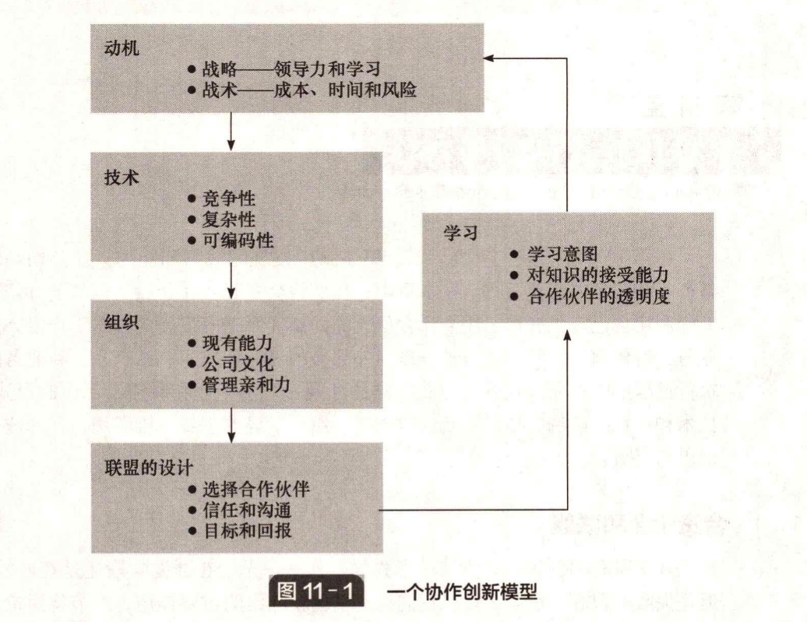

# 11.1 合资企业和联盟

&#x20;       几乎所有的创新都需要某种形式的合作 —— 无论在开发阶段还是在商业化阶段，但是失败率很高。在第7章，我们讨论了创新网络的重要作用，本节将讨论双边合作或合资企业的更具体的问题。我们将讨论在新技术和新产品开发以及新公司创办过程中协作的作用，特别是以下几方面的问题：

* 企业为何合作？
* 不同环境下最适合采用的合作形式分别是什么？
* 技术因素和市场因素如何影响联盟的结构？
* 什么样的组织和管理因素会影响联盟的成败？
* 一个公司如何利用联盟来学习新技术和市场能力？

### 为何合作？

公司之间合作有许多可能的原因：

* 降低技术开发或市场进入的成本；
* 降低开发或市场进入的风险；
* 实现生产制造的规模经济；
* 缩短产品开发和商业化的周期；
* 促进分享学习。

&#x20;       就具体情况来说，一个公司可能有多个动机去建立合作联盟。然而，为便于分析，不妨将合作的原因归类为技术方面、市场方面和组织方面的动因（见图 11-1）。技术原因包括成本、时间和开发的复杂性。在当前竞争激烈的商业环境中，研发职能部门与公司的其他职能部门一样，不得不实现更高的财务效率，并且要批判性地检验内部开发是不是最有效率的途径。此外，人们越来越认识到一个公司的外围技术可能是另一个公司的核心业务，因而将这样的技术外包往往更加合理，因为这样可以避免相应的风险、成本，最重要的是节省内部开发的时间。

&#x20;       技术变革迅速，许多技术日趋复杂，很少有公司能够在每一个潜在相关的技术领域维持内部的专业能力。许多产品的演变结合了越来越多的技术，例如汽车现在引入了许多计算机软硬件来监控引擎、传动装置、刹车和悬挂系统。大多数研发经理和产品经理认识到，无论多大规模的公司，都不可能作为技术孤岛而生存下去。例如，在开发捷豹XK车型时，福特公司与日本的电装公司（Nippondenso）合作开发了引擎管理系统，与德国的ZF公司合作开发了传动和控制系统。此外，外部技术源作为摄供新兴或迅速发展的科技领域的进展的信息窗口，越来越受到重视，特别是当研发来自公司传统业务领域之外或海外业务时。

&#x20;       当决定自主研发或购买一项技术时，需要考虑两个因素：交易成本和战略意义。交易成本分析聚焦于组织效率，特别是市场交易涉及很高的不确定性时的影响。风险可以估计，也可以以概率分布的形式界定；然而不确定性不同于风险，不确定性是指未知的结果。对于涉及技术创新的项目，不确定性主要与项目完成进度、性能和竞争对手先进入等有关。而对于涉及市场进入的项目，不确定性主要与缺少相关的地理知识或产品市场知识有关。在这种情况下，公司往往宁可轴性高财务回报，以力求减少不确定性。

&#x20;       然而，技术知识或市场知识的卖方可能会采取机会主义的行为。这里的机会主义行为指的是以高价格出售低水平的技术等。通常，潜在技术源越少，买方的议价能力越弱，交易成本就越高。此外，在技术很复杂的情况下，很难评估其性能表现。因而当一项技术的潜在买家对手技术本身所知甚少时，交易成本会更高。技术购买不同于生产或维护这类常规任务的转包，因为很难通过合同具体指定交付内容。

&#x20;       其结果就是，技术购买要求买家和卖家比普通的市场交易双方有更紧密的关系，这样才能形成多种可能的购买策略和购买机制。在某种具体情况下，最理想的技术购买策略取决于技术成熟度、公司相对于竞争者的技术地位以及技术的战略意义。如果一项技术是新颖的、复杂的或稀缺的，某种形式的合作通常是必要的。相反，如果技术是成熟的、简单的或广泛可得的，那么像转包合同或特许经营等市场交易形式就更合适。然而，长期基于交易成本的比较来外包不同的技术，其累积效应可能会限制未来的技术路径选择，并削弱长期竞争力。

&#x20;       在实践中，影响外部技术购买决策的最重要因素并不是交易成本。像竞争优势、市场扩张和扩充产品组合这样的因素更加重要。5]采取更具战略性的视角可以将注意力集中在长期的组织效能上，而不是仅仅关注短期效率。早期的规范的战略研究强调了技术开发对于公司和商业战略的支持作用，因而技术购买决策的步骤始于对公司优雾势的评估。更近期的基于资源的观点则强调资源积累或学习的过程。能力开发要求公司有明显的政策或意图把合作作为学习的机会，而不是仅仅为了控制成本。这表明对外部技术的购买应被当作内部研发的一种补充，而不是一种替代。事实上，技术购买的策略有助于实现日益复杂的技术的多元化。

&#x20;       无论是交易成本还是战略行为，都不能单独全面地解释现实，在某种程度上，这两者是互补的。例如，对高层管理者的一项调查发现，在评估技术合作时他们考虑的最重要的两个问题是技术的战略意义和降低开发风险的可能性。所以，战略因素和交易成本因素都很重要。战略思考会明确哪些技术应当内部开发，交易成本会影响如何获得其他所需的技术。公司在购买外部技术时会试图降低交易成本，具体表现为比起其他技术来源，它们更偏向于选择现有的交易伙伴。简言之，为了实现成功的技术购买，选择合适的交易对象可能和寻找最好的技术同样重要。与熟悉的公司打交道对于双方来说都意味着更低的交易成本：它们更可能有某种程度的相互信任、相互分享的技术和商业信息以及个人层面的社会关系。研究礼记11.1比较了创新型合作的正式治理与关系治理。

研究机记11.1创新型合作的正式治理与关系治理关于创新型合作的研究将治理机制分为正式治理机制（比如政策和合同）以及关系治理机制（比如文化、沟通和信任）。然而在实际中，根据合作伙伴目标的一致性和绩效模糊性，这些正式治理和关系治理模式会产生不同的相互影响。一项对289家公司的调查发现：目标的不一致性和绩效的模糊性越高，合同的复杂程度也会越高，进而影响合作契约中的主导文化。合同模糊性的增加促进了更多的科层制和市场伙伴关系文化，但抑制了宗族文化。合同的复杂程度则和宽松灵活的文化发展呈负相关关系。该研究展现了目标的一致性和绩效的模糊性通过合同复杂程度的中介作用，对创新型合作文化的影响。资料来源：SchweitzerJ.，Howcontractsandculturemediatejointtransactionsofinnovationpartnerships.InternationalJournalofInowationManagement，2016.20（1）.人们愈发认识到，接触外部技术源可以给组织带来更多好处，例如，为内部研发提供 “同行评议” 从而减少 “排外主义” 的影响，或者以新想法和不同视角质疑和挑336创新管理（第6版）战内部研究者。此外，许多管理人员认识到某种类型的外部开发技术具有战术价值其中一些越来越被视为获取顾客或政府好感的方式，被作为推广统一的行业标准的方式，以及影响行业法律法规的手段。曼彻斯特理工大学（UMIST）调查了100多个总部设在英国的联盟，证实了市场透导动因对于战略协作的相对重要性（见表11-1）。特别地，产品开发合作的最常见的理由是为了响应顾客和市场需求的变化。然而，这些数据仅仅说明了合作的动机而不是结果。该研究发现，尽管许多公司成立战略联盟以试图降低研发的成本和风险缩短研发周期，但它们未必从这种合作关系中真正得到了好处。事实上，研究的结论是，大约半数被访者认为合作使得开发更加复杂而且费用更高。然而，还是要将所得利益与合作自标联系起来看。例如，专门为了降低研发成本或缩短研发时间而建立联盟的公司通常可以实现这个目标，为了其他目的而建立联盟的公司则更可能抱怨这种合作会导致开发成本和时间的增加。研究还发现了一些与战略合作相联系的潜在风险：信息泄露；·丧失控制权或所有权；·目标分岐，导致冲突。表11-1合作的动机均值（n=106）为了响应关键顾客的需要4.1为了响应市场需要4.1为了回应技术变革3.8为了降低研发风险3.8为了拓宽产品线3.7为了降低研发成本3.7为了加快进入市场的速度36为了回应竞争者5为了回应管理层的提议3.3为了在产品开发中更具创新性3.3说明：1一低，5=高。资料来源：Littler，D.A.，Risksandrewardsofcollaboration..1993，UMIST，Manchester大约1/3的被访者表示曾经遇到此类问题。信息泄露是与潜在竞争者合作时出现的最严重的问题，因为合资企业和其他企业很难完全区分开，因此不可能避免合作伙伴通过一定渠道获得额外的知识和技能。这些额外的信息可能是市场情报，也可能是更加隐性的知识或技能。其结果就是一家公司可能会失去对合资企业的控制，并导致合作伙伴之间的冲突。一项对约200家公司关于技术是自主研发还是购买的决策的研究得出结论：来自外部的产品和流程技术常常带来立等见影的效果，如更低的成本或在更短时间内将产品推向市场，但长期来看不利于公司产品的差异化，以及公司在市场上确立或维持定第11章探索开放式创新与合作337位优势。相反，成功的成本领先战略或差异化战略（波特战略模型的两极，参见第4章）都是基于内部的流程技术或产品技术开发的。然而，在高度动态的环境中，市场不确定性较大并且技术变革很快，这种情况下将技术外包远远好于完全依靠内部能力。例如，在高科技行业（比如信息通信技术和生物技术行业）存在高水平的合作互动，而在较成熟的行业合作水平较低。在更高科技的行业，公司通常寻找的是互补性资源，例如，许多生物技术公司（做基础研究）和医药公司（负责临床试验、生产、营销和配送渠道）都建立了合作关系。在医药行业，由与生物技术公司之间建立的研究联盟的数量可以推测出正在升发的产品数量，根据产品数量又可以推测其用于构建销售配送渠道的推销联盟的数量。在更加成熟的行业，更常见的情况是合作伙伴投入相似的资源来分担成本和风险，或者努力达到某个资源门槛或实现规模效应。在合作伙伴的选择上也有差别。更高科技行业的公司偏重于它们与同行和竞争者的横尚关系，而更加成熟的行业的公司往往重视与供应商和顾客的纵向关系。2在公司层面，研发强度与合作倾向之间存在相关性，那些正在开发市场上的新产品的公司比那些开发对于公司而言为新产品的公司更倾向于合作。这是因为更新颖的创新需要更多投入，也要求投入具有新颗性，并且面对更大的市场不确定性。
