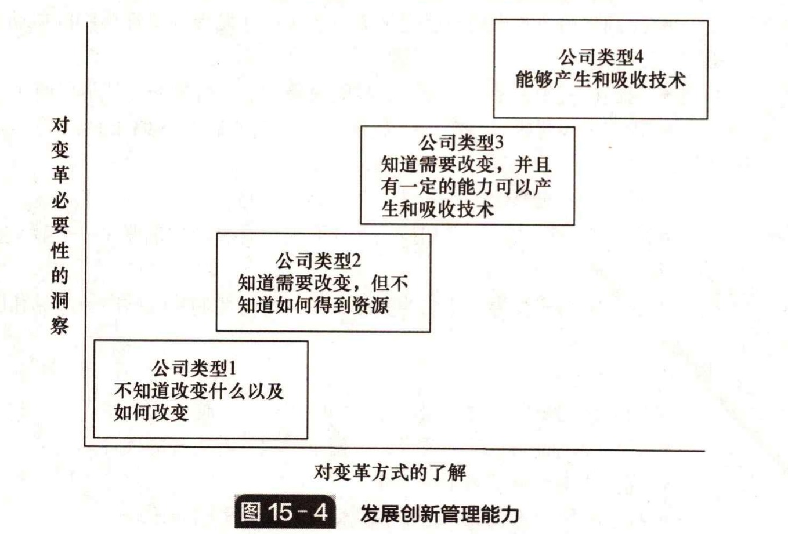

# 15.10 发展创新能力

&#x20;       许多研究关注的是在创新中该衡量什么、如何衡量等问题。我们如此关注这些问题，以至于忽略实际的目标 —— 反思对流程的管理并提高管理水平。特定工具的形式并不重要，重要的是通过使用它来对影响创新成败的因素进行广泛的评估，以及掌握对过程的管理加以改进的方法。这种创新审计提供的是：

* 一个审计框架，既可以用来检查你在某次特定的创新中做对了什么、做错了什 么，也可以作为一种理解事情缘由的方式。
* 一个核对清单，让你检查自己是否在做正确的事情。
* 一个参照基准，用来检查你是否和别人做得一样好。
* 一个对创新管理进行持续改善的指南。
* 一个帮助你获取知识的学习资源，并提供尝试新事物的灵感。
* 一种聚焦于带有特殊问题的子系统的方式，让你和流程的所有者及其客户与供应商一起工作，看看通过讨论是不是可以让事情变得更好。

&#x20;       举例来说，一个组织如果没有清楚的创新战略，也没有什么技术资源，甚至没有获取更多资源的计划，同时项目管理水平有限，外部联系贫芝，组织氛围刻板而不具有支持性，创新就很难成功。相反，一个组织如果专注于清楚的战略目标，发展长期的外部联系来支持技术开发，同时有清晰的项目管理流程，有高层管理者的支持，而 且在一个创新性的组织氛围中运作，就更容易成功。

&#x20;       图 15-4 给出了一个框架来思考关于发展创新管理能力的问题。

&#x20;       当然，没有哪个组织一开始就有完美强大的能力来组织和管理创新。它必须经过试验和试错学习，慢慢找出哪些行为有效、哪些行为无效，并且逐渐通过重复和强化使之成为“惯例”。发展创新能力涉及建立和强化这些惯例，并且回顾和检查它们是否仍旧合适或者是否需要修正或替代。前沿视点 15.1 给出了一些例子。关键问题是：

* 我们需要多做些什么，强化什么？
* 我们需要少做些什么，停止做什么？
* 我们需要发展什么新惯例？


前沿视点15.1

关于创新管理的主要教训

&#x20;       创新能力是很难创造却又容易摧毁的。这并非一劳永逸的事情。在商业环境中， 遵规守矩被看成是至高无上的。在这样的环境中，创新能力需要持续的培养和保护。 它同样需要持续的关注来保持前进的动力 —— 它就像是一架飞机，总要不断前进才能保持在空中。对创新的管理要求一种创新的方法。&#x20;

&#x20;

**要做到：**

* 在推动创新时大张旗鼓；&#x20;
* 鼓励高层管理者在推进创新中扮演积极重要的角色；&#x20;
* 鼓励挑战和质疑；&#x20;
* 允许实验； 间或允许张扬个性；
* 避免公司官像主义；
* 铭记发展创新能力需要时间；
* 持续监测创新绩效；
* 确保团队有清晰的目标和终点，而不是严格要求有具体的成果；
* 允许相关人员自由地尝试自己的新想法；
* 在整个公司中保护创新。&#x20;

**不要这样做：**

* 迷失目标 —— 忘记为何创新；
* 利用你的创新能力和资源，将之作为削减成本的简便手段；
* 对于实现成果的方式墨守成规；
* 在创新团队中强制保持一致；
* 允许分配过多的资源或时间，这会缓解提出解决方案的压力；
* 试图照本宣科地管理创新。&#x20;

&#x20;                                                                —— **帕特里克 • 麦克劳克林**，Cerulean 公司执行董事&#x20;

要做到： 建立一个基于项目制的组织； 建立一个好的业务组合管理结构； 建立一个漏斗系统或门径管理制度，用来分阶段筛选项目； 484创新管理（第6版） ·保证创新相关的活动配备足够多的人力。 不要这样做： 0只给人们指定职能性职位； 不了解在创新漏斗中项目是否正确推进 —沃特·塞曼，CRHInsulationEurope 不要过度管理，一般来说人们都希望把事情做好； ·在你身边组建最好的团队，具体来说就是找到比你更优秀的人 向你的团队成员学习，也不要害怕他们向你学习； ·化繁为简，事情往往不必如此复杂； ·不要试图衡量一切：关键在于顾客第一。 约翰·特里加斯基斯，Serco公司技术经理 专注于清晰描述的“结果”，例如你试图实现的成果，然后将你手头的稀缺资 源与创造性人才联系起来，为实现这个结果而寻找创新的实现方式 要做到： 充分利用工具，并把对工具的使用制度化； 有趣； ·任用背景相异的各种人； 0如果可以，不要亲自在场； 珍视和鼓励作出贡献，让一切可以简单开始 关注大型创新项目所驱动的创新，同样关注自下而上的参与 将早期的成功展示出来并大力宣传，以吸引管理层的注意： ·在头脑中要有创造性的发散过程，也要有汇集方案的方法。 不要这样做： 只建立机制，期待奇迹 ·对管理制度的诠释坊碍了我们的行动（既要遵守规矩，也要探究规则背后的解释）； ·只坐在办公室里而不出去有看； ·低估同伴压力的影响； 0个人冒险或创造性思考。 约翰·吉尔伯特，瑞士联合银行流程优化主管 ·创新过程的前端必须与标准的开发流程（例如门径管理模型）相分离； ·让投入的人去做值得投入的事以降低“无聊应付”的风险； ·对于高层管理者来说，很难对创新项目保持几年的关注，同样也很难接受突破 性创新项目比渐进性创新项目有更高的风险。 约翰·泰斯马尔，丹麦IctalCare公司执行董事 频繁地与运用你的技术的终端用户交谈，了解可能有损于你的创新实用性的其 他限制条件。 在创新管理方面，我最大的教训（至少在石油和天然气行业）是人的因素以及 技术发展中的变革管理比大多数人想象的还要重要。这很可能是这个行业中导致许多 创新失败的“阿喀硫斯之题”。我们需要记住，在世界500强公司工作的大部分人都 专注于用既有的方法和技术来为公司赚钱。当一个创新者带来一个新想法时，许多人 第15章从创新中获取经验知识485 都会将其推进过程看成是对他们日常工作流程的干扰。创新者似乎本能地认为新技术 一定比它所取代的东西要好，但他的同事未必这么想。相应地，要将一个新技术推广 至能源行业，需要大量的销售努力，要不届不提地说服其他人。谨记的教训是，非研 发部门的同事未必会以和你一样的方式来看待新技术。 不要假定人们自然地就想要利用你的创新成果。事实上这可能要花费数年时间。 ·尽你所能让一项技术成功，但如果技术没有得到应用，不要觉得是失败。如果 你从未失败，那么说明你并没有挑战极限。 罗布·佩罗尼，美国壳牌勘探有限公司


&#x20;&#x20;
