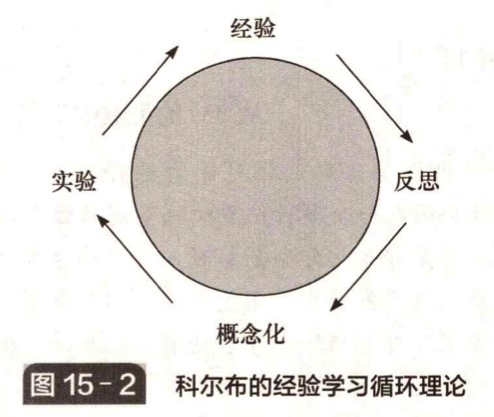

# 15.3 如何管理创新

&#x20;       我们可以将图 15-1 中的创新过程看作一个学习循环 —— 收集能够产生响应的信 号。所有这些都强烈地表明，公司应当采取某种形式的创新项目来帮助开发技术和管 理两方面的能力。表示组织中可能发生的学习过程的一种方式是采用一个学习循环 的简单模型，图 15-2 显示了科尔布（Kolb）的经验学习循环理论。&#x20;

&#x20;   这里，学习被视为获取：

* 对于过程的系统而大胆的反思 —— 发生了什么，什么行得通，什么出了差等。
* 概念化 —— 提取经验教训，基于所学知识将之编码到体系中，并最终体现为规程。
* 实验 —— 愿意在下一次尝试不同的管理方式，检验所学的经验是否有效。
* 直接获取经验（即使失败的代价很高）—— 这样我们才有反思的素材。&#x20;

&#x20;       能否有效地学习创新管理并从创新管理中学习，取决于能否围绕这些主题建节 个学习循环。从这个意义上讲，它是一个适应性的学习系统，帮助组织在环境中生存 和成长。但是要保证这个适应性的系统能够良好运转，还需要第二个学习循环 —— 它 能够对系统重新编程以便根据环境的变化和系统的表现作出调整。（这类似于中央空 调系统 —— 有一个适应性循环，会根据房间里的温度变化调整输出。但是我们也需要 去思考和重新设定恒温器来适应变化的环境。）这种循环式的或有效的学习是创新管 理挑战的核心。我们如何定期回顾整个系统的运行情况，并使其适应新的环境 这是建立动态能力的挑战。&#x20;

&#x20;       我们也应当认识到舍弃的问题。学习新的学习方法不只是掌握和强化新的行为模 式 —— 你往往还要舍弃旧的行为模式。就此放手定属不易，并且有一种很强的超势 会促使你返回现状或实现某种平衡 —— 这有助于解释为什么为数不少的现有竞争者发 现行业新进入者在利用新技术或新商业模式的新兴市场大抢风头。若不存在这种超 势，被反超的行业竞争者的数量之多将令人惊说。管理非连续性创新要求你能够弃车 保师，并寻找其他行业对手可能会尝试的创造性破环游戏规则的方式。通用电气公司 前首席执行官杰克·韦尔奇的一个著名举动就是给他的高级经理们发了一份备忘录， 要求他们告诉自己如何毁掉他们手头的生意。当然，这件事的意图并不是执行这些毁 灭计划，而是通过这个挑战便人们意识到做好放手准备的必要性，并重新思考，决定 是否舍弃。在对韩国现代（Hyundai）的造船部门的研究中，金林苏（Linsu Kim） 谈到了构建危机的强有力的方法 —— 创造一种紧迫感和挑战感，让学习和忘却同时发生。多萝西 • 伦纳德（Dorothy Leonard）警告称，当“核心能力”变成“核心僵化”时，自满情绪就会滋生，从而阻碍组织意识到变革信号。
