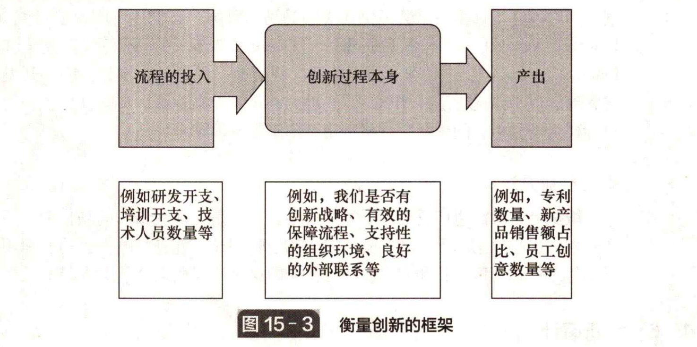

# 15.6 创新审计

&#x20;       能力/成熟度审计反映出以一种结构化的方式来反思创新过程和管理方式。这类似于财务审计。通过对账本进行财务审计可以了解公司的健康状况和运营情况。其原理很简单：基于我们对成功和不成功的创新及其所依赖条件的了解，可以构建组织相 关问题一览表。我们可以根据最佳实践的某种模型对组织的绩效打分，并识别哪些方 面有待改进。&#x20;

&#x20;       这种审计方法与创新管理的实践有很大的潜在相关性，许多框架被开发出来以支持它。早在 20 世纪 80 年代，英国国家经济发展办公室（UK National Economic Development Office）开发了一个 “创新管理工具箱”，之后一个致力于推动中小企业创新管理的欧洲项目将其更新和调整并作为项目的一部分投入使用。另一个起初由伦敦商学院开发的框架，经过英国贸易与产业部（UK Development of Tradeand Industry）的推广，衍生出一系列框架，包括与英国设计委员会（Design Council）合力推出的 “鲜活的创新”。弗朗西斯（Francis）提供了关于这种例子的概述。这一传统在英国 NESTA 的工作中得以延续，该基金会委托开展了一系列研究，以帮助制定一项创新指数，为创新实践和绩效提供一个衡量框架。

&#x20;       其他涵盖创新管理特定方面的框架也在发展，如创新氛围、持续改进和产品开发。随着互联网应用的普及，诞生了一些为创新管理绩效评估提供互动性框架的网站。这种绩效评估正是组织发展的第一步。&#x20;

&#x20;       在任何情况下，创新审计的目的都不在于分数或得奖，而在于通过添加结构化反思的维度来建立有效的学习周期。重要的是定期回顾和讨论这个过程，而不是关注细节性的信息或精确的分数。要点并不仅仅是收集数据，而是使用这些测量数据来驱动创新过程及其管理过程的改进。正如质量管理大师爱德华 • 戴明（W. Edwards Deming）指出的，“如果你不去测量，你就不能提高！”

&#x20;       开展这种创新审计通常涉及两个方面：

* 我们在创新成果方面的表现如何？
* 我们在重复运用创新技巧的潜在能力方面做得如何？

&#x20;       图 15-3 展示了我们可能采取的措施，包括流程的投入和产出、我们的核心利益、流程本身的组织和管理方式。理查德 • 亚当斯（Richard Adams）及其同事给出了 这种方法的概述。

