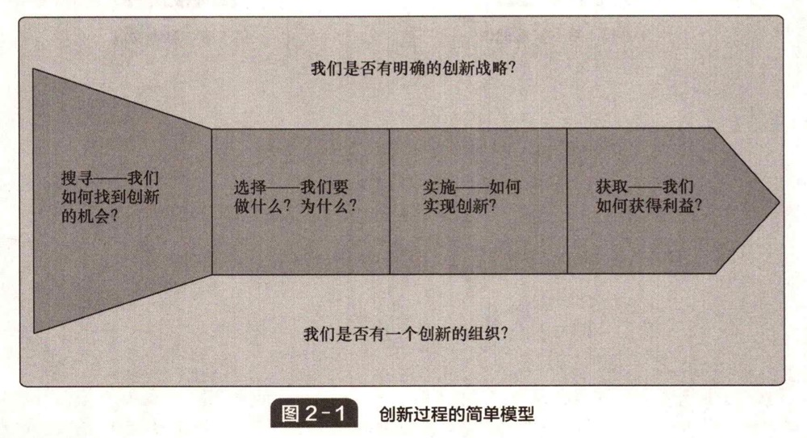

# 第2章 作为核心商业过程的创新

**Innovation as a Core Business Process**&#x20;

&#x20;       在第 1 章中，我们提出了将创新作为组织内部核心的更新过程的观点。创新是一个与企业的生存和成长密切相关的普通过程，可以视为所有企业需要经历的基本过程。组织面临的挑战是找到管理创新过程的方法，为公司产品的更新、创造和交付提供一个较好的解决方案。创新的核心部分包括：

* 搜寻 —— 分析环境（内部和外部）、相关信号的处理过程，以及变革所带来的威肠和机遇。
* 选择 —— 决定（基于如何更好地发展企业的战略视角）应该回应哪些信号。&#x20;
* 实施 —— 将潜在的想法转化为新的事物，并应用于内部和外部市场。做到这些并非易事，它需要人们致力于获取能够产生创新的知识资源，在不确定的情况下执行计划，需要解决大量的问题，并将创新应用到相关的内部或外部市场。&#x20;
* 从创新中获取价值 —— 无论是从可持续的采购和分销来看，还是就在这一循环发展中得到学习而言，组织可以建立自己的知识库，改进过程管理的方式。&#x20;

&#x20;       在本章中，我们将探讨影响这一核心过程的一些因素，以及核心创新主题的不同变化。&#x20;

&#x20;       图 2-1 提供了一张简图，我们将这张图作为贯穿全书的框架，以帮助理解开拓创新管理的方式。

