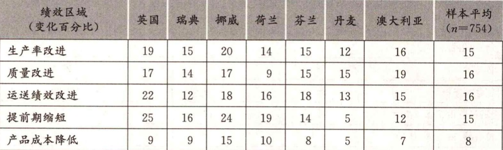

# 3.4 全员参与创新

&#x20;       然而，创新通常被看成是研发、营销、设计或 IT 专家的职责，他们都拥有潜在的创造性技能和问题解决能力。如果在整个组织能够找到一种机制将这些能力集中于一个适当的基点，由此产生的创新潜能是巨大的。虽然每个个体只能够进行有限的和新进性的创新，但所有这些努力会产生深远的影响。

&#x20;       这方面的一个例证就是日本制造业在第二次世界大战后创造的 “质量奇迹”，本人将成功归因于他们所说的 “kaizen” —— 持续改善。像丰田和松下这样的公司每年能从员工那里收集几百万条改进建议，其中很大一部分得到了采纳。很多国家的个案研究证实了这种模式。一位英国管理人员说：“我们的经营成本比去年同期减少了，而效率提高了。通过改进质量，我们的成本在过去两年半的时间内下降了 35% 与 1990 年的零条建议相比，现在每位员工平均有 21 条建议。我们做到了。” 案例研究 3.5 给出了另一个例子。


<mark style="color:orange;">**案例研究 3.5**</mark>

&#x20;                                                                          **全员参与创新**         &#x20;

&#x20;       乍一看，XYZ 公司并不像大家所说的世界一流的制造商。它坐落在一个以农业为主的小镇上，星用了大约 30 名员工为加油站生产量规和其他测量装置。它的产品被用来监控和测量加油站的大油箱和给加油站运油的油轮的各个参数。尽管规模很小（是一个更大的但分散的组织的一部分），但 XYZ 公司已经占据了 80% 的欧洲市场这个地位是通过竞争基至是和一些大制造企业进行竞争获得的；它的交付和服务水平得到了行业内其他企业的认可。它获得了大量的质量方面的奖项，然而在一系列产品中做到这一点花了大约 30 年，并且这些产品仍然需要提供服务和维修。XYZ 公司使用的技术很多，从复杂的电子学、遥感技术到一些基本原理，例如它们仍然制作木制标尺。

&#x20;       作为英国最好的工厂，它的成功可以用盈利数据来衡量，也可以通过它已经获得的和即将获得的其他奖项来衡量。

&#x20;       走进 XYZ，你可能想弄明白该公司是如何获得令人美慕的地位的。说它是一家高度自动化的公司也许并不恰当。公司里并没有现代化的设施，却创造了现有的环境，并对环境进行合理组织以使其发挥最佳效果。

&#x20;       区别在哪里呢？根本区别在于员工的工作方式。这是一个非常重视培训的组织 —— 培训的投入远高于行业平均水平，每个人都得到了大量培训，培训不仅提高他们的特殊技能，而且涉及广泛的任务和技能。这种培训的成效就是劳动力非常灵活能够处理大多数业务，快速转移到最需要他们的地方。薪酬系统鼓励这种合作，其结构简单，主要按照技能、质量和团队合作付副。战略目标清晰简单，在制定政策的过程中和每个人都进行充分的讨论，随后战略目标被分解为一系列小的管理改进项目。围绕工作有一些简单的 “保龄球图” 副本（如 “保龄球评分表”），闸明改进项目的待完成任务以及这些任务怎样构成公司的总体战略目标。如果员工达到或超过了这些战略目标，将通过利润分享和员工持股计划获得收益。

&#x20;       作为一个小公司，很少有等级感，通过积极的领导以及鼓励一起讨论和解决问题，增强了团队合作意识。这也不会影响运营总监的四处走动式管理。

&#x20;       真正的秘决可能在于，员工受到激励去探寻和解决问题，经常尝试不同的解决方式—即便失败也至少获得了学习的机会，而且与他人交流信息以便他人能够找到解决办法。环顾工厂四周，可以很清楚地看到工厂并不是一成不变的—尽管新机器方面的大投资并不是每天都有，但是小的改进项目到处可见。更重要的是，运营总监通常会对员工正在做的事感到惊话 —— 很显然他并不是很清楚员工正在完成哪一个项目以及他们正在做什么。但如果问他是否担心，答案很明确并且富有挑战性 —— “不担心，尽管我并不是非常清楚他们在干什么。他们都知道公司战略，也都知道公司要做什么（通过保龄球图）。他们都经过培训，知道怎样改进项目，他们是一个团队。我相信他们.....”


&#x20;       虽然这类全员参与计划和全面质量管理、精益生产一起在 20 世纪后期受到了广泛的关注，但它们并不是新概念。这些概念的提出可以追到1871年，当时，丹尼（Denny）在苏格兰敦巴顿的船厂有一项制度，要求工人带来一些 “变化，这些变化要么是在质量上有显著改进，要么是在成本上更加经济”，并给予奖励。美国国家收银机公司（National Cash Register Compary）创始人约翰 • 帕特森（John Patterson）在 1894 年左右提出一项建议，奖励那些利用他所称的 “集思广益的创意” 的计划。

&#x20;       很多员工参与创新主要关注增量变化，因此效果甚微。然而研究显示，从长远来看，它是影响组织战略发展的关键因素。

&#x20;       持续的渐进性创新的隐含之意就是组织文化支持和鼓励创新。这在很多领域已经被意识到，所有的研究都强调这样一种观点：更高水平的创新参与度代表着一种竞争优势。例如：

* 在质量管理领域可以很清晰地看到，主要优势来自更好的和更加一致的产品和服务。克劳士比（Crosby）对质量成本的研究显示，战后很多日本制造商节省费用的实效（一般为营业总额的 20%～40% ）和经验提供了令人信服的论据。
* 在过去 20 年间，“精益思想” 这一概念深入人心，应用于制造业、服务业以及化学品生产、医院管理和超市零售。它最初源于对汽车组装厂的研究，强调最好的工厂和一般的工厂在一系列维度上的差异，包括生产率、质量和时间。关于优势来源的研究发现，主要差异不是来源于高水平的资本投资或者更加现代化的设备，而是生产的组织和管理方式。进行该研究的学者得出结论：“我们的研究令人大开眼界。日本工厂生产一辆豪华汽车所付出的努力是美国工厂的 1/2，是欧洲最好的工厂的 1/2，是欧洲一般工厂的 1/4，是欧洲最差豪华车生产商的 1/6。同时，日本工厂的质量远远超过欧洲工厂的质量，除了一家工广之外 —— 但这家欧洲工厂需要付出四倍的努力来组装相关的产品......”
* 这种替代模式的重点就是强调团队合作和参与创新。
* 精益思想背后的原理来自日本制造技术的经验。与电子、汽车、钢铁制造业不同，这一系列做法（包括如“实时管理”等想法和防错措施等具体技术）被认为是帮助日本制造商赢得强大的行业竞争力的关键。在这些技术背后隐藏着一种原理强调员工在创新过程中的高水平参与，特别是通过持续的渐进的问题解决方式 —— 持续改善。

&#x20;       这种想法在不同地点以及在不同应用领域的可转移性受到了关注。从相关研究中可以看出，精益制造的原理能够延伸到供应和分销链、产品开发和研究，以及服务活动和业务营运中。此外，不存在特定的国家文化方面的障碍：创新中的全员参与方法已成功地移植到很多地方。案例研究 3.6 描绘了不同组织中的全员参与创新。


案例研究 3.6

全员创新的推广

&#x20;       这种方法推广得有多远？为什么组织选择利用这种方法？这些组织得到了什么好处？什么阻碍了组织进一步沿着全员参与的方向发展？

&#x20;       这类问题为一项在欧洲许多国家实施的大型调查提供了动机，澳大利亚在 20 世纪 90 年代末期实施了这项调查。这是合作研究网络的成果之一，合作研究网络的建立是为了在全员创新领城分享经验和宣传好的实践。该项调查涉及7个国家的1000个组织，提供了一张实施和体验全员创新的有用的地图。（调查仅覆盖了制造业，虽然后续工作也关注了服务业。）主要的调查结论如下：

* 总的来说，大约 80% 的组织意识到了这个概念及其相关性，真正实施且以较先进的方式实施的大约有一半的企业。
* 企业系统地实施全员创新的平均时间为 3.8 年，这说明并不存在快速解决方案，必须作为一项重大战略承诺来执行。事实上，那些被认定为 “CI创新者” —— 运行良好的全员参与系统 —— 的企业在这方面平均已投入7年。
* 全员参与对于很多企业仍然名不副实，它们的大多数努力都集中于车间，而不是组织的其他部门。企业的成熟水平与全员参与的发展之间存在一定的联系 ——  “CI创新者” 群体更可能在整个组织推广这种做法。
* 不同企业实施员工参与创新的动机大不相同，但目的主要集中于提高质量、降低成本和提高生产率几个方面。
* 在全员创新的产出方面有一些有力的证据，每年人均提出建议 43 条，有一半已得到采纳。这个数据在测度和定义上可能存在差异，但是它确实支持了这样一种观点，在广泛的地城范围内劳动力存在巨大潜力 —— 这不仅仅是发生在日本的现象。样本企业也报告了所产生的间接收益，包括提升士气和动力以及对变革的态度更加积极。
* 当然，这些建议能对提高绩效发挥作用才是最重要的，从调查中获得的证据表明核心战略目标受到了影响。
* 平均有 15% 左右的改进涉及过程方面（如质量、运送、生产提前期和总生产率），平均有 8% 的改进涉及产品成本方面。具有重要意义的是绩效的提高与企业在全员参与行为方面的成熟度相关。“CI创新者”将全员参与作为做事的方式取得成功的公司也是获得最大盈利的公司，在上述过程方面平均盈利率为 19%\~21%。

&#x20;                                

* 几乎所有的全员创新活动都是发生在 “规范之内” 的基础上，也就是说，作为正常工作模式的一部分，而不是作为一种自愿的“规范之外”的活动。这类活动大多以工作组的形式进行，虽然几乎有 1/3 的活动是基于个体的。
* 为了支持全员创新，工具和技术被广泛使用，特别是那些与发现和解决问题相关的技术和工具，80% 的样本企业在使用。除此以外，在质量管理、过程控制和想法生成方面也使用了大量的工具，更加专业化的技术（如统计过程控制或质量功能展开）的应用并不那么普遍。更重要的是，即使是一般的发现和解决问题的工具，也只有大约 1/3 的员工接受了正规培训。

资料来源：Adapted from Boer et al.，_CI changes: From suggestion box to thel earning._ 1999，Aldershot：Ashgate


公司层面的研究支持这一观点。IdeasUK是一个独立机构，为希望制定和维持员工参与计划的公司提供建议和指导。它起源于英国建议计划协会，为企业提供了解和分享全员参与方法和经验的机会。IdeasUK对约160名组织成员进行的年度调查显示，其公司节省的成本超过1亿英锈，实施的创意平均价值1400英锈，投资回报率约为5：1，员工参与率约为28%。具体的例子包括西门子标准驱动器（SSD）建议方案，该方案产生的想法每年为公司节省约75万英。这家电气工程巨头每年收到大约4000个创意，其中约75%付诸实施。制药公司辉瑞的方案节省了约25万英锈，ChessingtonWorldofAdventures的创意计划节省了约5万英。当然，这在很大程度上取决于企业规模——例如，宝马Mini在考利的工厂节省了近1000万英锈，它将此归功于员工的参与。类似的数据也可以在其他国家找到。例如，美国员工参与协会（EmployeeInvolvementAssociation）的一项研究表明，通过实施建议制度，公司每位员工每年可以节省近200英锈。据IdeaAmerica报道，大约有6000个项目在运行。在德国，ZentrumsIdeen管理层报告的公司节省额如下（2010年的数据）：德国邮政DHL2.2亿欧元，西门子1.89亿欧元，大众9400万欧元。重要的是，这些好处并不仅限于大型企业，也惠及中小型企业，比如TakataPetri节省630万欧元，HerbierAntrieb-stechnik节省310万欧元，MitsubishiPolyesterFilm节省180万欧元。对164家德国和奥地利公司的150万名工人调查发现，约20%（32.6万）的工人参与其中，贡献了近100万个创意。其中有2/3实施，节省10.86亿欧元。在投资约为1.09亿欧元的情况下，这样的回报十分惊人。表3-3总结了这些成就。表3-3德国和澳大利亚公司的全员创新关键指标数据创意/每百名工人（个）62参与率21%创意实施率69%节省额/每工人（欧元）622投资额/每工人（欧元）69实现每个创意的投资额（欧元）5实施的每个创意的节省额（欧元）1540创意/每年每员工平均6个，最多21个资料来源：ZentrumsIdeenmanagement，2011来自欧洲各地的调查数据表明，大多数大型组织已经开始实施全员创新。另一项涉及七个国家1000多个组织的大型调查提供了一份有用的资料，说明制造业中全员创新的实践和经验。总体而言，大约80%的组织了解这一概念及其相关内容，但是实第3章建立创新型组织091际的实施，特别是以更进步的形式进行全员创新，只有大约一半的公司能做到。研究礼记3.6明确了支持员工主导型创新的四个促进因素。研究礼记3.6员工主导型创新英国的许多组织中，各级员工定期提供创意。朱利安·伯金肖和丽莎·杜克（JulianBirkinshawandLisaDuke）通过对这些组织的研究确定了四个关键因素。\[28]暂停：为员工在工作日提供创造性思维空间；广阔的角色：帮助员工超越其指定工作的范围；比赛：刺激行动，让创意的源泉流动起来；开放式论坛：给予员工方向感，促进合作。资料来源：Birkinshaw，J.andL.Duke，Employee-ledinnovation.BusinessStrategyReziew，2013.24（2），46-50，越来越多的人意识到这一点，使得管理问题从是否需要员工参与变为如何做到。启动全员参与创新的难度远比不上维持参与以使组织真的发生变化。很多组织都有启动这个过程的经验——在“蜜月期”最初的想法和热情猛增，随后逐步消退直至很少或没有任何全员创新活动。我们对此不必感到惊话，很明显，从长远来看，想要改变人们的思维和行为方式，就需要一个战略发展计划。精蜓点水式的培训加上一点总经理的热情，对于从根本上改变“我们在这里做事的方式”——组织的隐性文化一—不可能有太大用处。
