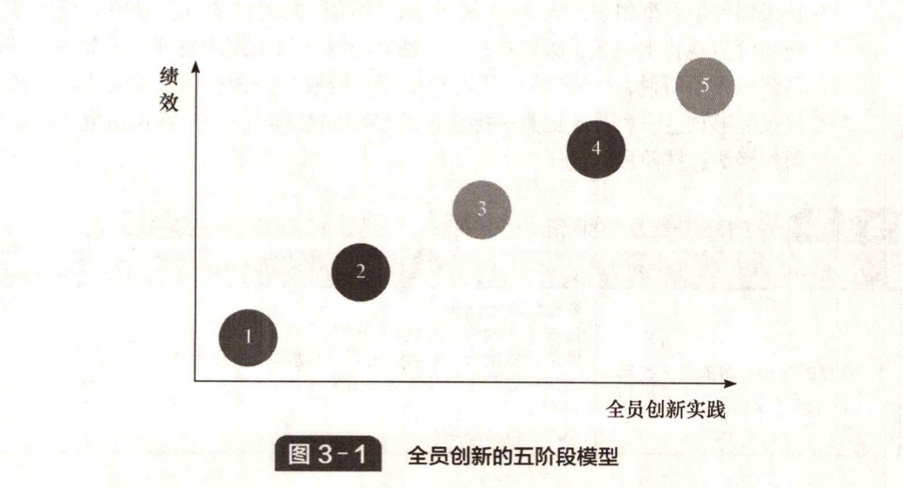

# 3.5 过程路线图

&#x20;       关于实施全员创新的研究表明，全员创新过程包括几个阶段，成效主要表现在系统发展、让员工参与进来的能力以及最终效益等方面。每一个方面都要花费时间，并且不能保证组织一定会成功进入下一个阶段。前进意味着必须找到克服不同阶段特定障碍的方法（见图 3-1）。

&#x20;       阶段 1 是我们所说的“无意识的全员创新”阶段。全员创新活动即使有也很少，而且本质上是随机的和偶然的。人们时常会帮助解决一些问题，例如，他们聚在一起解决一些涉及新系统或工作程序的问题，或者找出新产品的缺陷。但是，他们并没有正式地尝试去启动或组织这些活动，并且很多组织可能会阻碍这类活动。这一阶段正常的状态是，全员创新不是刻意追求的，没有得到认可，没有得到支持，甚至没有意识到。每唐置疑，这类变革对组织几乎没有什么影响。

&#x20;       阶段 2 代表了组织动员全员创新的第一次正式尝试。它包括为了结构化和系统化地发现和解决问题建立一种正式程序，并培训和鼓励员工来使用。为了动员和鼓励员工持续参与而给予奖励/认可就是很好的支持形式。通过一定形式的系统管理想法，可以处理尽可能多的问题和取得尽可能大的进展，以及处理一些无法执行的想法。在整个系统的背后是有着合适机制的基础结构（团队、任务组或其他）、服务人员和一定形式的领导小组，领导小组保障全员创新的实施并对其运作进行监督和调整。如果没有高层管理人员的支持及承诺做后盾，所有这一切都不可能发生。为了保持进步，有必要进入全员创新的下一个阶段 —— 关注战略重点和系统改进。

&#x20;       阶段 3 涉及将全员创新习惯与组织战略目标联系起来，使得各种本地团队和个体的改进活动能够与组织战略目标保持一致。为此，有必要增加一些关键的行为 —— 战略部署、监控和测量活动。战略（或政策）部署包括对组织整体战略进行闸述，并将其分解为可管理的小目标，不同领域的全员创新活动参照小目标进行定位。与此相关的是，有必要学习监控和测量一个过程的绩效并由此来驱动持续的改进。阶段3的活动揭示了一个观点，全员创新会最终取得显著成效，例如，减少吞吐量次数、降低废品率、减少过多库存等。全员创新中大多数的“成功故事”能够在这个阶段找到，但这并不是旅程的终点。

&#x20;       阶段 3 中全员创新的局限性在于活动的方向很大程度上由管理人员制定，并限定在一定的范围内。创新活动可能出现在不同的层面 —— 从个体到小组再到跨职能团队，但仍然是被动型的并受外部指挥。阶段 4 引入了一种新的要素 —— 对个体和小组的授权，有助于员工主动试验和创新。

&#x20;       阶段 5 是名义上的旅程终点 —— 每个人都充分参与试验和改进过程，分享知识积极创建学习型组织。表3-4展示了每个阶段的关键要素。最后的任务就是建立共同的价值观将组织成员凝聚在一起，使其能够参与组织的发展。正如在一项研究中一名管理人员所说，“······我们从没有使用 '授权' 一词！你不能对人进行授权 —— 你仅仅能够创造一种员工愿意承担责任的环境和结构······” 案例研究 3.7 给出了一个组织经历这些阶段的例子。

**表 3-4 全员创新能力演化阶段**

| 发展阶段                 | 典型特征                                                                                                                                         |
| -------------------- | -------------------------------------------------------------------------------------------------------------------------------------------- |
| 1、“自然的” /不显眼的全员创新    | <ul><li>问题解决的随机性</li><li>没有正式的努力或结构</li><li>偶尔迅猛发展，但会因不开展活动和不参与而中断</li><li>解决问题的主要模式是依靠专家</li><li>短期收益</li><li>不产生战略影响</li></ul>             |
| 2、结构化的全员创新           | <ul><li>正式尝试建立和保持全员创新</li><li>使用正式的问题解决过程</li><li>鼓励参与</li><li>对使用基本的全员创新工具进行培训</li><li>结构化的想法管理系统</li><li>认可系统</li><li>通常是平行的操作系统</li></ul> |
| 3、目标导向的全员创新          | <ul><li>上述所有方面，加上正式的战略目标部署</li><li>监控和测量背离这些目标的全员创新活动</li><li>协调系统</li></ul>                                                                 |
| 4、主动的/授权的全员创新        | <ul><li>上述所有方面，加上责任机制和准时机制等，都是为了形成问题解决单元</li><li>内部指导而不是外部指导的全员创新</li><li>高水平的试验</li></ul>                                                   |
| 5、完全的全员创新能力 —— 学习型组织 | <ul><li>将全员创新作为主要的生活方式</li><li>自动获取和分享学习经验</li><li>每个人都积极参与创新过程</li><li>新进的和突破性的创新</li></ul>                                                 |


<mark style="color:orange;">**案例研究 3.7**</mark>

&#x20;                                                           **为全员创新创造条件**         &#x20;

&#x20;       Dutton Engineering 公司第一眼看上去并不像世界一流企业。一家拥有 28 名员工、专营钢铁行业电子设备的小型公司，应该是那种仅能糊口的企业。然而，Dutton 的营业额已经翻番，在 8 年的时间里员工人均销售额增加了一倍，退货率从 10% 下降为 0.7%，超过 99% 的送货都是在 24 小时内完成的—几年前仅有 60% 的送货能在一星期内完成。这种转变不是在一夜之间发生的，而是始于 1989 年，最终取得了成功。Dutton 为其他小企业树立了一个榜样，表明小型工程企业也能进行变革。

&#x20;       发生这种转变的关键是承诺通过人的作用来改进，公司的创始人和变革的设计者肯 • 刘易斯（Ken Lewis）曾进行这种变革。工人被分成自我管理的四个组，自己制定工作计划，与顾客打交道，确定订单的成本，甚至确定自己的薪副。公司已经从传统的周薪支付转换为 “按年计算的小时制”，按照合约他们必须在一年之内工作 1770 小时 —— 这样灵活安排的目的是适应业务的高峰期和低谷期。公司对好的想法支付 5～15 英锈，同时拿出 20% 的利润进行分享，公司简单的奖励制度和奖金计划对解决问题有很大的帮助。

资料来源：Lewis，K. and S.Lytton，How to transform your company. 2000，London：Management Books.

