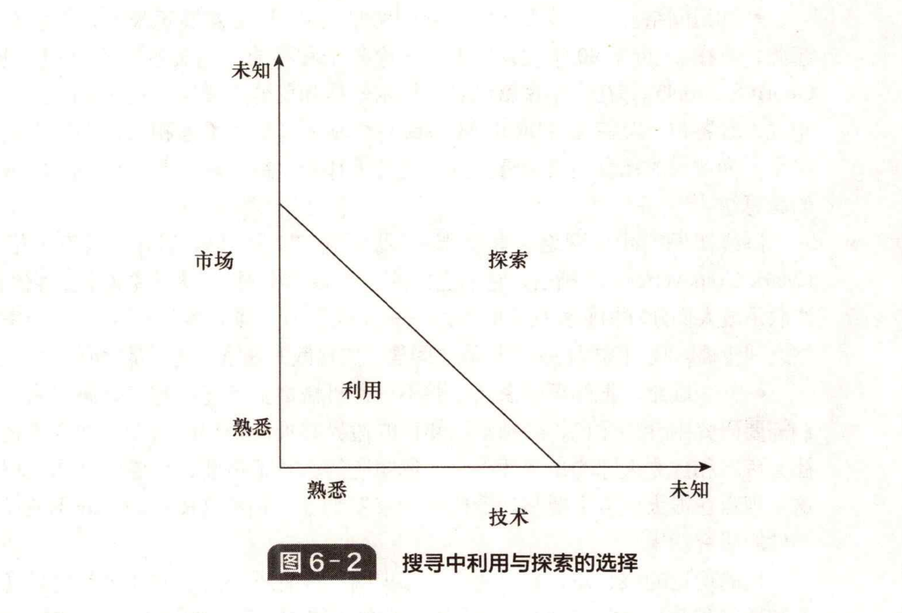

# 6.1 创新的机会

&#x20;       许多新的商业理念发端于之前没有人关注的需求或满足现有需求的新方法，因此要了解人们对商品和服务的潜在需求，从而探索满足需求的不同方式。

### 推动创新或拉动创新？

&#x20;       需要考虑的一个重要问题是推力和拉力的相对重要性。在过去的许多年里，这已经成为研究的重点，人们往往利用不同的方法试图寻找并搭建一个相对重要的研究平台（找到配置资源的最佳方式）。事实上，创新并不仅仅是一个关于拉力还是推力的问题，而是一个两者结合的问题。如克里斯 • 弗里曼（Chris Freeman）所说， “需求是创新之母，但创造力的发展还需要其他的因素” 。创新要解决一个问题 —— 实现需求和外力的协同作用。这就将我们的注意力引向两个方向：创造新的可能性（或者至少是关注他人在研发前沿的进展），以及发现需求。重要的是，在创新中需求扮演的角色通常会通过知识推动体现出来。筛选所有可能性，我们最终会得到主流设计。iPod 并不是第一个 MP3，但是它最大限度地满足了我们的需求。

&#x20;       实际上，许多创新源都包括推力和拉力两种力量的结合——比如，应用型研发项自大多需要将技术与特定需求相结合。在一些关键点上，规制会起到改变环境的作用。用户引导的创新可能是由用户的需求激发出来的，并通过一些新的手段解决旧的问题 —— 总的来说，是在新的方向上进行新的研究。

&#x20;       将注意力集中在单纯的形式上，并不是解决推力和拉力问题的良好途径。如果我们把所有的鸡蛋放到一个篮子里，那么所有优秀的发明就不会转化为一个个有突破性的创新，这将对那些想成为企业家的人造成打击。然而，如果过于关注来自市场的着法，就会如享利·福特所说的那样， “如果我当初在造车之前问一间大家的意见，他们会说我们想要更快一点的马！” 这种市场调查研究方法只是反映人们固有的一些想法，但往往不会提出超出经验的假想。

### 渐进性创新或突破性创新？

&#x20;       创新的另一个关键问题是关于渐进性创新和突破性创新。正如我们在第1章看到的，创新包括从渐进性创新（ “做得更好” ）到突破性创新（ “做完全不同的事” ）。而且我们已经看到，创新中有一个 “间断平衡” ——多数时候，创新是指探索和发现，在现有技术的基础上对某个主题进行探索。然而在这个过程中偶尔会有一些突破——这个过程会进行自我循环。这就说明我们在探寻创新透因时，应该看到创新中一些潜在的推进方式，比如一个软件产品的更新可能仅仅是外包装标识（2代、3代、4代）的不断变化，以使得这个产品更加容易销售。但是，我们需要通过一些元素的组合在较大的范围内进行高风险的运作，以产生突破，建立一个新的运行轨迹。

&#x20;       除了规模最小的初创企业以外，我们将寻求创意组合的平衡——其中多数创意都是在过去的基础上 “做得更好” 的渐进式改进，但也有少数创意更具突破性，甚至可能是世界首创。这类创新的一大优势在于人们对它较熟悉，风险更低，我们正沿着一条已经走过的道路前进。这样做的收益可能较低，但其效果是累积的。而我们寻找这些机会的方式——工具和方向——基本上是确定的和系统化的。

&#x20;       相比之下，跨越式发展可能带来巨大收益，但也会带来更高的风险。由于我们进入未知领域，需要进行实验，但大部分实验会失败。我们不清楚前进的方向，因此存在走进死胡同或被困在单行线上的风险。从本质上讲，我们所做的搜寻以及使用的工具将是不同的。

### 利用还是探索？

&#x20;       讨论创新的核心主题涉及搜寻中 “利用” 和 “探索” 之间的张力。一方面，企业需要部署知识资源和其他资产以确保回报，这是 “安全” 的做法，也是为了通过 “做得更好” 获得稳定的收益。这个过程被创新学者定义为 “利用” ，因为在这个过程中我们做的事是 “使用并发展已知的事物” 。 “知识利用活动” 15]建立在现有基础上 —— 但在此过程中导致高度的路径依赖 —— “企业积累的开发经验加强了领域内的既定惯例” 。

&#x20;       问题在于，在一个不确定的环境中，捍卫竞争地位的潜力取决于 “做一些不同的事情” ，也就是突破性的产品或流程创新，而不是模仿或提供其他公司产品的变体。这种搜寻被称为 “探索” ，是一种 “跳远或重新定位，使公司能够采用新的属性和获得其领域之外的新知识” 。

&#x20;       前面提到的张力源于支持这两种活动所需的组织惯例不同。渐进性利用型创新是一种高度结构化的过程，通常是在运营单位内进行的高频、小规模的创新，突破性创新则是偶然的、高风险的，往往需要特定的、跨职能的资源组合及更宽松的组织和管理方法。

&#x20;       进行探索和利用活动没有捷径，但是天多数组织综合使用这两种方式，做到 “两手抓” 。例如，技术搜导活动是通过投资一系列研发项目来管理的，其中包括一些异想天开（blue-sky）型活动或高风险的外部投入，以及集中于核心技术轨迹的项目。2市场研究也使用类似的方法，对关键细分市场进行深度的、敏捷的理解，同时也围绕外围和新兴范围进行探索。图 6-2 展示了这一概念。

