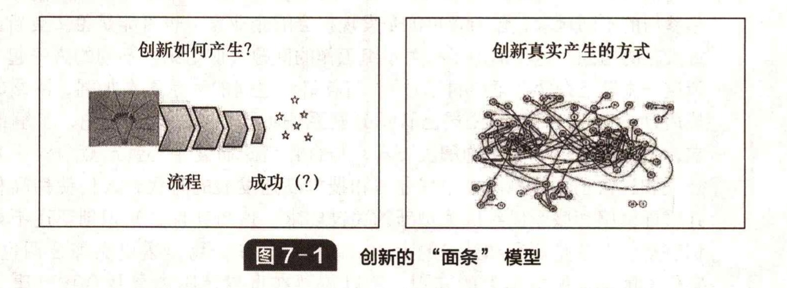

# 7.1 关于创新的 “面条” 模型

&#x20;       正如我们在第 2 章指出的，创新可以被看成是一个有着确定的结构和众多影响力的核心过程（如图 7-1 所示）。这种视角有助于我们将事情简化为几个清晰的阶段，并识别出，如果我们想要成功地管理这个过程，需要对哪些关键点施力。但是，简化的模型远远没有现实复杂。当我们在模型化过程中处理正在发生的事情时，实际的情形可能更复杂。一个创新项目中知识的实际流向是复杂的、互动的，不同的人以不同的方式相互交谈不同的事情，所有这些都像 “面条” 一样彼此交织。图7-1右边的图像给出了另一个视角。

&#x20;       这种复杂的互动涉及知识、知识流动的方式以及知识是怎样结合从而使创新得以发生和展开的。无论是企业家建立一个网络，帮助他的捕鼠器进入市场，还是苹果公司推出最新一代的iPod或手机，在这个过程中都会涉及知识网络的建设和运行。此外，创新变得更加复杂，网络涉及多个不同的参与者，其中许多人可能来自企业外部。当我们实施复杂的大项目（如建造新的飞机或医院设施）时，参与者的数量和网络给管理工作带来的挑战会变得相当大。这同样会带来难题：伴随着越来越多的虚拟网络，我们必须学会利用遍布全球的丰富的人力资源，并通过互联网、宽带和共享计算机网络进行联系。

&#x20;       这一切都不是创新研究领域的新概念。这种研究可以追潮到 20 世纪 50 年代的英国，例如卡特和威廉斯（Carter and Williams）指出，注重技术进步的创新型企业远比本土化的、内向型的同行更加国际化。SAPPHO 项目、 “知识财富” 研究以及其他的一些研究工作（诸如艾伦在 20 世纪六七十年代对美国太空计划的详细研究），都得出了相似的结果。安德鲁对托马斯 • 爱迪生和亨利·福特进行研究后强调他们不仅仅是单个的天才，他们也了解创新网络的动力，并能够建立一个创造和维持创新网络的团队。事实上，早期对佛兰德编织工人、意大利或英国的枪支制造业的研究表明，创新网络早已建立，并作为成功创造新产品和新工艺的方式加以应用。

&#x20;       我们不应忽视在组织中管理知识的重要性。近年来，人们对于知识管理的兴趣增大，开始关注更好的知识流动机制，例如社区实践、守门人乃至最近的社会网络分析等。

&#x20;       这种网络是罗伊 • 罗思韦尔在关于创新模型的开创性研究工作中所预见到的，他预测说，对于线性科学/技术推动或者需求拉动过程的思考将逐步转向对日益增多的网络间活动的关注。起初，这存在于拥有跨职能小组的公司和跨边界的活动中。渐渐地，它通过与外部行动者的联系转移到了外界。罗思韦尔关于 “第五代” 创新的构想（见专栏 7.2），实质上是指我们现在需要借助丰富多样的通信网络之间的联系，以及信息和通信技术来创新。


<mark style="color:blue;">**专栏 7.2**</mark>

&#x20;                                                           **网络对于创新的重要性**         &#x20;

&#x20;       关于更高层次的网络创新有四个主要论点：

1. 集体效率 —— 在一个要作出诸多反应的复杂环境中，除了最大的公司外，其他公司要在内部保持创新能力是很难的。互联网提供了一种通过共享的交流过程以接触不同资源的方法，这种强调集群式知识的交流机制已被意大利、西班牙以及其他国家的小公司证明是成功的。
2. 集体学习 —— 网络不仅提供分享稀少或昂贵资源的机会，而且可以促进共同学习的过程，在其中合作伙伴交流经验，挑战模式和做法，带来新的见解和看法，并支持共享实验。在许多实例中 “学习网络” 已被证明是工业发展过程中成功的助推器，详见本章后面的一些例子。
3. 集体承担风险 —— 基于集体活动的网络能比单一的活动参与者承受更高层次的风险。这也是许多竞争性联盟开展高风险研发活动的基本原理。
4. 不同知识集的交集 —— 网络还允许在不同的知识前沿建立不同的关系，并为参与其中的组织提供新的刺激和经验。


